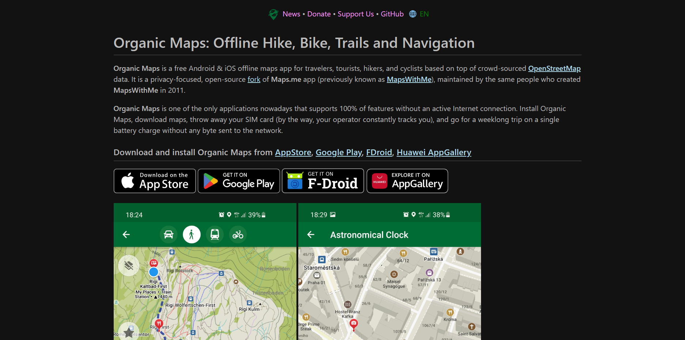

# CoMaps Website

This static website is built with [Zola](https://www.getzola.org/)

<!--  -->

## Development

- Download the latest zola for your operating system and set up the necessary path variable.

- Make sure to switch to the `main` branch (the default is `pages` due to the way Codeberg Pages serves sites)

- Run `zola serve` for a local preview or `zola build` to generate static site in the `public` folder.

- Run `npm i && npm run format` if you want to pretty-format the Markdown and SCSS files.

- Upgrade npm dependencies with `npm run upgrade`, make sure that you have installed `npm-check-updates` package.

## Deployment
The latest site is automatically deployed from `main` on the merging of a pull request.
It's also possible to manually deploy in the Actions menu.

## Contribution

Any good ideas and help with web site improvement are appreciated. And it's always better to discuss
any improvement before implementing it to sync with our vision and plans.

## Translations

We need your help to translate this site to your language. See [TRANSLATIONS.md](TRANSLATIONS.md) file for detailed instructions.
