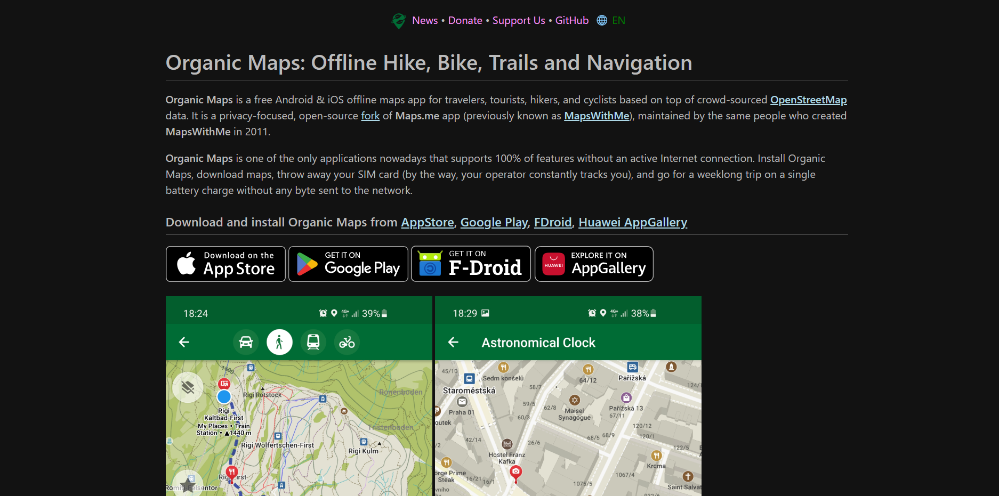

# CoMaps Website

This static [comaps.app](https://www.comaps.app/) website is built with [Zola](https://www.getzola.org/).

<!--  -->

## Translations

**We need your help to translate this site to your language on [Codeberg Translate][weblate].**

## Development

- Download the latest zola for your operating system and set up the necessary path variable.

- Run `zola serve` for a local preview or `zola build` to generate static site in the `public` folder.

- Run `npm i && npm run format` if you want to pretty-format the Markdown and SCSS files.

- Upgrade npm dependencies with `npm run upgrade`, make sure that you have installed `npm-check-updates` package.

### Content changes in `.md` files

Only the **English** Markdown files should be edited directly. After changing text in a `.md` file, please run `./tools/i18n.sh` as described in [TRANSLATIONS.md](TRANSLATIONS.md) to propagate the english changes to all other languages.

### Creating redirects

There are two different types of redirects that can be created: 1. Website internal redirects (or aliases) if you want a page to be accessible under multiple slugs. 2. External redirects (if you want a link from comaps.app to redirect to an external site, like e.g. Codeberg).

#### Internal redirects / aliases

In the front-matter of the markdown `index.md` or `_index.md` file, specify one or multiple aliases, like so:

```
aliases:
  - relative/path
  - another/path
```

#### External redirects

For those you need to create a sub-folder that matches the redirect source you want. E.g. For creating a redirect that links `comaps.app/latest` to Codeberg, you need to create a `content/latest/_index.md` and the target into the front matter, e.g.

```
---
redirect_to: "https://codeberg.org/comaps/comaps/releases"
---
```

### Shortcodes

Shortcodes are little templates that can be embedded in your markdown pages. Here are some shortcodes that are currently available.

#### Image

Use the image shortcode to add an image to your page.
For example:

```
{{ image(src="javi-and-rebecca-bikepackers.webp", alt="Javi and Rebecca", caption="Javi and Rebecca", classes="max-w-40") }}
```

- `src` (required) is the file name of the image. It assumes the image is placed in the same folder as the markdown page.
- `alt` (optional) is the alt tag you want to use for the image. Alt tags are always recommended to add for those who use screen readers.
- `caption` (optional), when used, puts the image in a frame (`<figure>`) and adds a visible caption that describes what's in the image. Usually `alt` and `caption` use the same value, but not always.
- `classes` (optional) any class names you want to assign to the image.

#### Quote
Use the quote shortcode to add a blockquote to your page. For example:

```

CoMaps can be used offline with or without network connection, comes with no annoying ads, and it doesn’t drain your mobile’s battery (unlike Google Maps). It’s available on Google Play, F-droid, IzzyOnDroid, Obtainium or APK download for Android, and on the App store for iOS.

```

- The main quote goes between the `` block and the `` block.
- `author` (required) the person who made the statement you're quoting. In some cases this could be a group or a company.
- `work` (optional) the name of the published work, like a book, website, etc, that the quote comes from. Think of it like the title in a citation.
- `url` (optional) a link to read the quote from it's source, if online.
- `date` (optional) adds a date representing when the quote was made.

## Deployment

The latest site is automatically deployed from `main` on the merging of a pull request.
It's also possible to manually deploy in the Actions menu.

## Contribution

Any good ideas and help with web site improvement are appreciated. And it's always better to discuss
any improvement before implementing it to sync with our vision and plans.

[weblate]: https://translate.codeberg.org/projects/comaps/website
