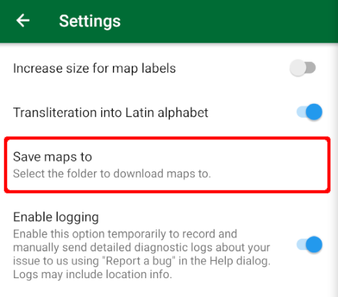

Yes, in the "Settings" menu the “Save maps to” option allows you to choose the location for map storage.  
  
The availability of this setting depends on your smartphone model, operating system, and other technical details.
