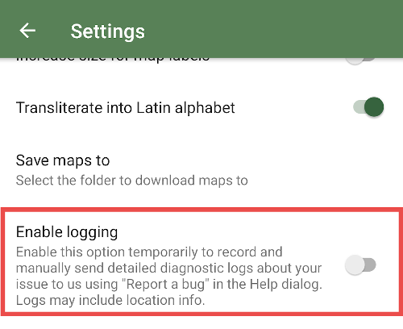
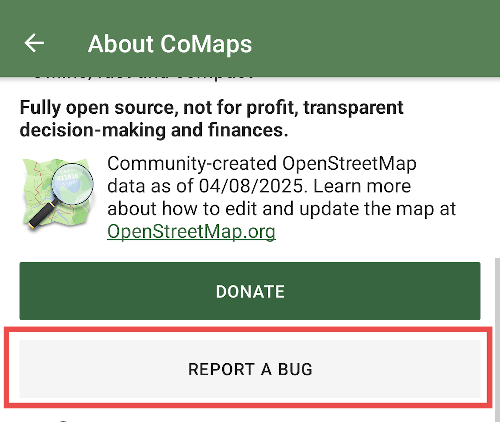

If you want to contact support and report a bug, providing app logs in your report could help locate a problem faster. To get useful app logs, go to “Settings → Advanced → Enable logging”. After that do whatever actions reproduce your problem.

Finally, tap on the button with the CoMaps icon on the main screen (or open the About & Help menu, if you've changed that button) and press the "Report a bug" button. Don't forget to disable logging after reporting.  

