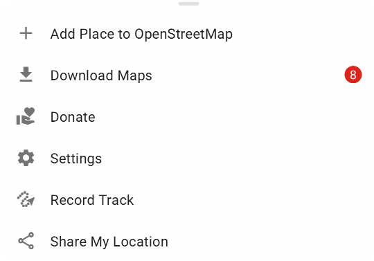

First, make sure that you have installed the updated app from AppStore, Google Play, FDroid, or Huawei AppGallery. If the map data is outdated, you will see a red warning in the settings button of the main screen bottom menu:  

In that case, you can download the latest maps from the “Download Maps” menu.

