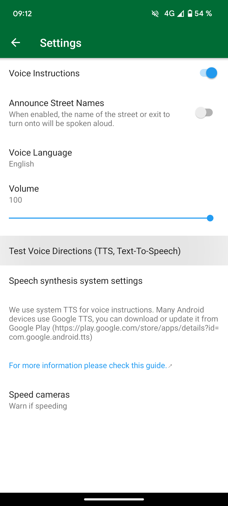

CoMaps uses the system Text-To-Speech (TTS) engine for voice instructions. The default engines vary by device. The choices can include Google Text-To-Speech, device manufacturer's engine or a third-party one.

The official recommendation from CoMaps is [RHVoice](https://rhvoice.org/), which is a free and open source speech engine that can be downloaded from [Google Play](https://play.google.com/store/apps/details?id=com.github.olga_yakovleva.rhvoice.android) and [F-Droid](https://f-droid.org/en/packages/com.github.olga_yakovleva.rhvoice.android/).

Instructions

* Open the Settings app on your Android device.  
* Select Additional Settings and then select Accessibility.  
* Choose your preferred engine, speech rate and pitch.

If you cannot find the relevant setting, open the settings app and search for Text-to-speech.

P.S: Do note that these steps will vary based on the phone brand you are using.

Said options may not appear if you don't have a TTS already installed on your device. Please refer to the table below to install any one of them that supports your native language.

Screenshots

|  |  |
| :---- | :---- |

Engines  
Below is a comprehensive list showing several engines and the languages they support (download links can be found after the table):

| Language |   Supported TTS Engines |
| :---- | :---- |
| Afrikaans |   eSpeak, Sherpa |
| Albanian |   RHVoice, eSpeak |
| Arabic |   Vocalizer, Acapela, Nuance, Sherpa |
| Aragonese |   eSpeak |
| Armenian |   eSpeak |
| Basque |   Vocalizer, Nuance |
| Bengal |   Vocalizer, Google, Nuance, Sherpa |
| Bhojpuri |   Vocalizer, Nuance |
| Bulgarian |   Vocalizer, Nuance, eSpeak, Sherpa |
| Cantonese |   Vocalizer, Google, Nuance, eSpeak, Sherpa |
| Catalan |   Vocalizer, Acapela, Nuance, eSpeak, Sherpa |
| Croatian |   Vocalizer, Nuance, eSpeak, Sherpa |
| Czech |   Vocalizer, Acapela, Nuance, eSpeak, Sherpa |
| Danish |   Vocalizer, Google, Acapela, Ivona, Nuance, eSpeak, Sherpa |
| Dongbei |   Vocalizer |
| Dutch (BE) |   Vocalizer, Nuance |
| Dutch (NL) |   Vocalizer, Google, Acapela, Ivona, Nuance, Sherpa |
| English (AU) |   Vocalizer, Google, Acapela, Nuance, RHVoice |
| English (IE) |   Vocalizer, Nuance |
| English (IN) |   Vocalizer, Google, Acapela, Nuance |
| English (SCT) |   Vocalizer, Nuance, RHVoice |
| English (UK) |   Vocalizer, Google, Acapela, Yandex, RHVoice, eSpeak, Sherpa |
| English (US) |   Vocalizer, Google, Acapela, Ivona, Yandex, Nuance, RHVoice, eSpeak, Sherpa |
| English (ZA) |   Vocalizer, Nuance |
| Esperanto |   RHVoice, eSpeak |
| Estonian |   eSpeak, Sherpa |
| Faroese |   Acapela |
| Farsi |   Vocalizer, Nuance, eSpeak |
| Finnish |   Vocalizer, Google, Acapela, Nuance, eSpeak, Sherpa |
| French (BE) |   Vocalizer |
| French (CA) |   Vocalizer, Nuance |
| French (FR) |   Vocalizer, Google, Acapela, Ivona, Nuance, eSpeak, Sherpa |
| Galician |   Vocalizer, Nuance |
| Georgian |   RHVoice, eSpeak, Sherpa |
| German |   Vocalizer, Google, Acapela, Ivona, Nuance, eSpeak, Sherpa |
| Greek |   Vocalizer, Acapela, Nuance, eSpeak, Sherpa |
| Gujarati |   Sherpa |
| Hebrew |   Vocalizer, Nuance |
| Hindi |   Vocalizer, Nuance, eSpeak |
| Hungarian |   Vocalizer, Google, Nuance, eSpeak, Sherpa |
| Icelandic |   eSpeak, Sherpa |
| Indonesian |   Vocalizer, Google, Nuance, eSpeak |
| Irish |   eSpeak, Sherpa |
| Italian |   Vocalizer, Google, Acapela, Ivona, Nuance, eSpeak, Sherpa |
| Japanese |   Vocalizer, Google, Acapela, Nuance |
| Kannada |   Vocalizer, Nuance, eSpeak |
| Kazakh |   Sherpa |
| Korean |   Vocalizer, Google, Acapela, Nuance, Sherpa |
| Kurdish |   eSpeak |
| Kyrgyz |   RHVoice |
| Latvian |   eSpeak, Sherpa |
| Lithuanian |   eSpeak, Sherpa |
| Luxembourgish |   Sherpa |
| Lojban |   eSpeak |
| Macedonian |   RHVoice, eSpeak |
| Malay |   Vocalizer, Nuance, eSpeak |
| Malayalam |   eSpeak |
| Maltese |   Sherpa |
| Mandarin (CN) |   Vocalizer, Acapela, eSpeak, Sherpa |
| Mandarin (TW) |   Vocalizer, Google, Nuance, Sherpa |
| Marathi |   Vocalizer, Nuance |
| Nepalese |   eSpeak, Sherpa |
| Norwegian |   Vocalizer, Google, Acapela, Ivona, Nuance, eSpeak, Sherpa |
| Polish |   Vocalizer, Google, Acapela, Ivona, Nuance, RHVoice, eSpeak, Sherpa |
| Portuguese (BR) |   Vocalizer, RHVoice, Sherpa |
| Portuguese (PT) |   Vocalizer, Google, Acapela, Ivona, Nuance, eSpeak, Sherpa |
| Punjabi |   eSpeak |
| Romanian |   Vocalizer, Ivona, Nuance, eSpeak, Sherpa |
| Russian |   Vocalizer, Google, Acapela, Ivona, Yandex, RHVoice, eSpeak, Sherpa |
| Serbian |   eSpeak, Sherpa |
| Shaanxi |   Vocalizer |
| Shanghainese |   Vocalizer |
| Sichuanese |   Vocalizer |
| Slovak |   Vocalizer, Nuance, eSpeak, Sherpa |
| Slovenian |   Vocalizer, Sherpa |
| Spanish (AR) |   Vocalizer, Nuance |
| Spanish (CL) |   Vocalizer, Nuance |
| Spanish (CO) |   Vocalizer |
| Spanish (ES) |   Vocalizer, Google, Acapela, Ivona, Nuance, eSpeak, Sherpa |
| Spanish (MX) |   Vocalizer, Sherpa |
| Swahili |   eSpeak, Sherpa |
| Swedish |   Vocalizer, Ivona, Nuance, eSpeak, Sherpa |
| Tamil |   Vocalizer, Nuance, eSpeak |
| Telugu |   Vocalizer |
| Tatar |   RHVoice |
| Thai |   Vocalizer, Google, Nuance, Sherpa |
| Tswana |   Sherpa
| Turkish |   Vocalizer, Google, Acapela, Ivona, Yandex, Nuance, eSpeak, Sherpa |
| Ukrainian |   Vocalizer, Nuance, RHVoice, Sherpa |
| Valencian |   Vocalizer |
| Vietnamese |   Vocalizer, Nuance, eSpeak, Sherpa |
| Welsh |   eSpeak, Sherpa |

Downloads

* [Acapela Voices TTS](https://play.google.com/store/apps/details?id=com.acapelagroup.android.tts)  
* [Amazon Ivona TTS](https://apkpure.com/ivona-text-to-speech-hq/com.ivona.tts/download)  
* [eSpeak TTS](https://f-droid.org/en/packages/com.reecedunn.espeak/)  
* [Google Speech Services](https://play.google.com/store/apps/details?id=com.google.android.tts)  
* [RHVoice TTS (Recommended)](https://play.google.com/store/apps/details?id=com.github.olga_yakovleva.rhvoice.android)  
* [SherpaTTS](https://f-droid.org/packages/org.woheller69.ttsengine/) 
* [Vocalizer (Code Factory)](https://play.google.com/store/apps/details?id=es.codefactory.vocalizertts)  
* [Vocalizer 2 (Nuance)](https://nvda.ru/sintezatory-rechi-vocalizer-expressive2-dlja-nvda#)  
* [Yandex SpeechKit TTS](https://4pda.to/forum/index.php?showtopic=200728&st=4200#download)

Workarounds  
For Android 11, GrapheneOS, without Google services, try installing the TTS engine RHVoice from F-Droid. Voice instructions should work.

If you’re having trouble initializing the RHVoice TTS engine on LineageOS or other custom ROMs, try this workaround. RHVoice may not initialize properly and the app may crash, especially if you haven’t used any TTS engine on your phone before (e.g., new installation, factory reset, etc.). If you’re using a custom ROM like LineageOS without Google Play services and Speech Services by Google, and you want to use RHVoice as your preferred TTS engine, follow the instructions below as a workaround:

* Install the [eSpeak TTS engine](https://f-droid.org/en/packages/com.reecedunn.espeak) available on F-Droid

* Set it as the preferred system engine

  * Go to LineageOS main **Settings**.

  * Scroll down to **Accessibility**.

  * Select **text-to-speech output** and **Preferred engine** (left side) and make sure **eSpeak** is selected.

* Go back and press **play** to see if it is working

* Install [RHVoice](https://f-droid.org/en/packages/com.github.olga_yakovleva.rhvoice.android/) available on F-droid.

  * Open it, select the language you want to use, tap on the cloud icon (far left) to download voices.

  * Press play button to verify if it is working

* Set **RHVoice** as preferred engine (see step 2)

* Now, you should be able to use RHVoice without any problems

Testing  
In order to test the voice instructions, you can tap on "Test Voice Directions (TTS, Text-To-Speech)" in the CoMaps "Settings → Voice Instructions" menu or you can actually start a navigation to receive any voice output. CoMaps will not give you any voice instructions while you're standing still.  

