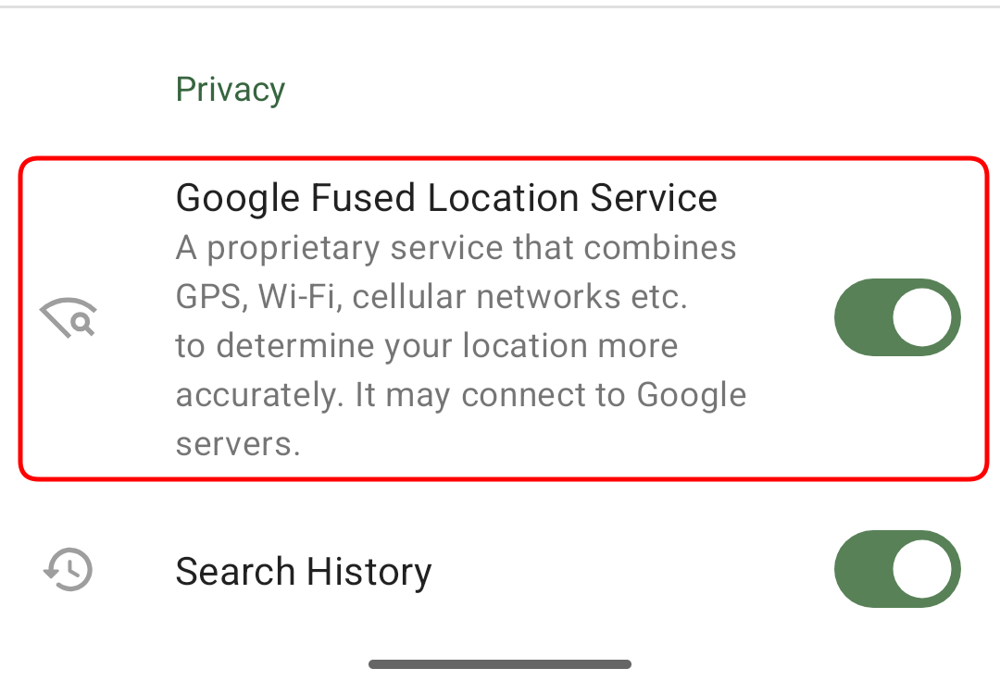

You can download and install OM for Android from different sources: Google Play, F-Droid, Huawey AppGallery or [CoMaps website](https://codeberg.org/comaps/comaps/releases/).

1. Play Store version has built-in world maps and may use Google Location services for faster location detection over WiFi or cellular networks (it can be disabled in OM settings). Note that Location Services setting disappears if your device doesn't have them installed for whatever reason (degoogled device, for example). Releases may be delayed by Google Reviewers or by partial availability to see if there are any regressions.  
With CoMaps from Google Play, you can disable Google Play Services for location search in the app’s settings menu:  

2. Github (Web) version is the same as Play Store except it doesn't have built-in World maps, which should be downloaded separately. You can auto-update it using Obtanium. It has a different ID so it can be installed separately with Google, Huawei, or Fdroid versions. And you can easily migrate your bookmarks. Available instantly. Note that Location Services setting disappears if your device doesn't have them installed.
3. FDroid version doesn't have world maps and doesn't have Google Location services library in it. That is why it may take a looong time to detect your position using GPS satellites only. It is usually updated in 3-7 days after Web version, but it may take even more time in case of issues.  
The F-Droid version comes without [Google Play Services](https://en.wikipedia.org/wiki/Google_Play_Services). These Services improve location accuracy using nearest cell towers and wifi hotspots if internet connection is available, so the F-Droid version uses only the device’s GPS sensor.
