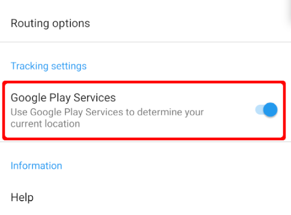

You can download and install CoMaps for Android from different sources: Google Play, F-Droid, IzzyOnDroid or [Codeberg](https://codeberg.org/comaps/comaps/releases/).

1. Play Store version has built-in world maps. It's also the only version that can be used with Android Auto due to Google restrictions. Releases may be delayed by Google Reviewers or by partial availability to see if there are any regressions.
2. Codeberg (Web) version is the same as Play Store except it doesn't have built-in World maps, which needt to be downloaded when first launching the app. You can auto-update it using Obtanium. It has a different App ID, so it can be installed alongside the Google, or F-Droid versions. And you can easily migrate your bookmarks. Available instantly. Note that the Google Fused Location Services setting disappears if your device doesn't have them installed.
3. F-Droid version doesn't have built in world maps (see Codeberg above). It is usually updated in 3-7 days after Web version, but it may take even more time in case of issues. 

All versions have [Google Fused Location Service](https://en.wikipedia.org/wiki/Google_Play_Services) available, but are using [microG re-implementation](https://github.com/microg/GmsCore/wiki) instead of the Google Play Services Location library and the feature is disabled in settings by default. Enabling Google Fused Location Services improves speed in detecting your location by using WiFi or cellular networks.
Without Google Fused Location Service enabled, it can take a long time to detect your position by using only GPS satellites.  
Note that the Google Fused Location Services setting disappears if your device doesn't have them installed for whatever reason (on a degoogled device, for example).

